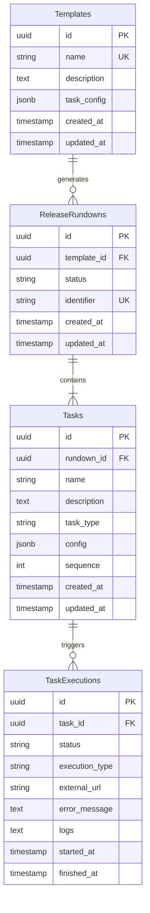

# Task Management System - Database Schema

## Entity Relationship Diagram



## Table Descriptions

### templates
- **Purpose**: Store task templates that can be cloned to create release rundowns
- **Indexes**: name (unique)
- **Estimated rows**: 100-1000

### release_rundowns
- **Purpose**: Generated from templates, contains a set of tasks for deployment
- **Indexes**: template_id, status, identifier (unique)
- **Estimated rows**: 1000-10000

### tasks
- **Purpose**: Individual tasks within a release rundown
- **Indexes**: rundown_id, sequence
- **Estimated rows**: 10000-100000

### task_executions
- **Purpose**: Track execution history for each task (Jenkins/Ansible)
- **Indexes**: task_id, status, started_at
- **Estimated rows**: 50000-500000

---

## SQL Schema (PostgreSQL)

```sql
-- Enable UUID extension
CREATE EXTENSION IF NOT EXISTS "uuid-ossp";

-- ============================================
-- TEMPLATES TABLE
-- ============================================
CREATE TABLE templates (
    id UUID PRIMARY KEY DEFAULT gen_random_uuid(),
    name VARCHAR(255) NOT NULL UNIQUE,
    description TEXT,
    task_config JSONB NOT NULL DEFAULT '[]',
    created_at TIMESTAMP DEFAULT NOW(),
    updated_at TIMESTAMP DEFAULT NOW()
);

CREATE INDEX idx_templates_name ON templates(name);

-- Trigger: auto-update updated_at
CREATE OR REPLACE FUNCTION update_updated_at_column()
RETURNS TRIGGER AS $$
BEGIN
    NEW.updated_at = NOW();
    RETURN NEW;
END;
$$ LANGUAGE plpgsql;

CREATE TRIGGER update_templates_updated_at
BEFORE UPDATE ON templates
FOR EACH ROW
EXECUTE FUNCTION update_updated_at_column();

-- ============================================
-- RELEASE RUNDOWNS TABLE
-- ============================================
CREATE TABLE release_rundowns (
    id UUID PRIMARY KEY DEFAULT gen_random_uuid(),
    template_id UUID NOT NULL REFERENCES templates(id) ON DELETE RESTRICT,
    status VARCHAR(50) NOT NULL DEFAULT 'pending' CHECK (status IN ('pending', 'in_progress', 'completed', 'cancelled')),
    identifier VARCHAR(100) NOT NULL UNIQUE,
    created_at TIMESTAMP DEFAULT NOW(),
    updated_at TIMESTAMP DEFAULT NOW()
);

CREATE INDEX idx_rundowns_template ON release_rundowns(template_id);
CREATE INDEX idx_rundowns_status ON release_rundowns(status);
CREATE INDEX idx_rundowns_identifier ON release_rundowns(identifier);

CREATE TRIGGER update_rundowns_updated_at
BEFORE UPDATE ON release_rundowns
FOR EACH ROW
EXECUTE FUNCTION update_updated_at_column();

-- ============================================
-- TASKS TABLE
-- ============================================
CREATE TABLE tasks (
    id UUID PRIMARY KEY DEFAULT gen_random_uuid(),
    rundown_id UUID NOT NULL REFERENCES release_rundowns(id) ON DELETE CASCADE,
    name VARCHAR(255) NOT NULL,
    description TEXT,
    task_type VARCHAR(50) NOT NULL CHECK (task_type IN ('jenkins', 'ansible', 'manual', 'script')),
    config JSONB DEFAULT '{}',
    sequence INTEGER NOT NULL DEFAULT 0,
    created_at TIMESTAMP DEFAULT NOW(),
    updated_at TIMESTAMP DEFAULT NOW()
);

CREATE INDEX idx_tasks_rundown ON tasks(rundown_id);
CREATE INDEX idx_tasks_sequence ON tasks(rundown_id, sequence);

CREATE TRIGGER update_tasks_updated_at
BEFORE UPDATE ON tasks
FOR EACH ROW
EXECUTE FUNCTION update_updated_at_column();

-- ============================================
-- TASK EXECUTIONS TABLE
-- ============================================
CREATE TABLE task_executions (
    id UUID PRIMARY KEY DEFAULT gen_random_uuid(),
    task_id UUID NOT NULL REFERENCES tasks(id) ON DELETE CASCADE,
    status VARCHAR(50) NOT NULL DEFAULT 'pending' CHECK (status IN ('pending', 'running', 'completed', 'failed')),
    execution_type VARCHAR(50) NOT NULL CHECK (execution_type IN ('jenkins', 'ansible', 'manual', 'script')),
    external_url VARCHAR(1000),
    error_message TEXT,
    logs TEXT,
    started_at TIMESTAMP DEFAULT NOW(),
    finished_at TIMESTAMP
);

CREATE INDEX idx_executions_task ON task_executions(task_id);
CREATE INDEX idx_executions_status ON task_executions(status);
CREATE INDEX idx_executions_started ON task_executions(started_at);
```

---

## Sample Data (H2 Database Compatible)

```sql
-- For H2 database (compatible with Spring Boot + JPA)
-- Use UUID as String or rely on JPA to generate IDs

-- Template table
CREATE TABLE templates (
    id UUID PRIMARY KEY,
    name VARCHAR(255) NOT NULL UNIQUE,
    description TEXT,
    task_config JSON,
    created_at TIMESTAMP DEFAULT CURRENT_TIMESTAMP,
    updated_at TIMESTAMP DEFAULT CURRENT_TIMESTAMP
);

-- Release Rundown table
CREATE TABLE release_rundowns (
    id UUID PRIMARY KEY,
    template_id UUID NOT NULL,
    status VARCHAR(50) DEFAULT 'pending',
    identifier VARCHAR(100) NOT NULL UNIQUE,
    created_at TIMESTAMP DEFAULT CURRENT_TIMESTAMP,
    updated_at TIMESTAMP DEFAULT CURRENT_TIMESTAMP,
    FOREIGN KEY (template_id) REFERENCES templates(id)
);

-- Task table
CREATE TABLE tasks (
    id UUID PRIMARY KEY,
    rundown_id UUID NOT NULL,
    name VARCHAR(255) NOT NULL,
    description TEXT,
    task_type VARCHAR(50) NOT NULL,
    config JSON,
    sequence INTEGER DEFAULT 0,
    created_at TIMESTAMP DEFAULT CURRENT_TIMESTAMP,
    updated_at TIMESTAMP DEFAULT CURRENT_TIMESTAMP,
    FOREIGN KEY (rundown_id) REFERENCES release_rundowns(id) ON DELETE CASCADE
);

-- Task Execution table
CREATE TABLE task_executions (
    id UUID PRIMARY KEY,
    task_id UUID NOT NULL,
    status VARCHAR(50) DEFAULT 'pending',
    execution_type VARCHAR(50) NOT NULL,
    external_url VARCHAR(1000),
    error_message TEXT,
    logs TEXT,
    started_at TIMESTAMP DEFAULT CURRENT_TIMESTAMP,
    finished_at TIMESTAMP,
    FOREIGN KEY (task_id) REFERENCES tasks(id) ON DELETE CASCADE
);
```

---

## JPA Entities (Java 21)

### Template.java
```java
@Entity
@Table(name = "templates")
public class Template {
    @Id
    @GeneratedValue(strategy = GenerationType.UUID)
    private UUID id;
    
    @Column(unique = true, nullable = false)
    private String name;
    
    private String description;
    
    @Column(columnDefinition = "JSON")
    private String taskConfig;
    
    private LocalDateTime createdAt;
    private LocalDateTime updatedAt;
    
    // Getters, setters, constructors
}
```

### ReleaseRundown.java
```java
@Entity
@Table(name = "release_rundowns")
public class ReleaseRundown {
    @Id
    @GeneratedValue(strategy = GenerationType.UUID)
    private UUID id;
    
    @ManyToOne
    @JoinColumn(name = "template_id")
    private Template template;
    
    @Enumerated(EnumType.STRING)
    private RundownStatus status;
    
    @Column(unique = true)
    private String identifier;
    
    private LocalDateTime createdAt;
    private LocalDateTime updatedAt;
    
    // Getters, setters, constructors
}
```

### Task.java
```java
@Entity
@Table(name = "tasks")
public class Task {
    @Id
    @GeneratedValue(strategy = GenerationType.UUID)
    private UUID id;
    
    @ManyToOne
    @JoinColumn(name = "rundown_id")
    private ReleaseRundown rundown;
    
    private String name;
    private String description;
    
    @Enumerated(EnumType.STRING)
    private TaskType taskType;
    
    @Column(columnDefinition = "JSON")
    private String config;
    
    private Integer sequence;
    
    private LocalDateTime createdAt;
    private LocalDateTime updatedAt;
    
    // Getters, setters, constructors
}
```

### TaskExecution.java
```java
@Entity
@Table(name = "task_executions")
public class TaskExecution {
    @Id
    @GeneratedValue(strategy = GenerationType.UUID)
    private UUID id;
    
    @ManyToOne
    @JoinColumn(name = "task_id")
    private Task task;
    
    @Enumerated(EnumType.STRING)
    private ExecutionStatus status;
    
    @Enumerated(EnumType.STRING)
    private ExecutionType executionType;
    
    private String externalUrl;
    private String errorMessage;
    private String logs;
    
    private LocalDateTime startedAt;
    private LocalDateTime finishedAt;
    
    // Getters, setters, constructors
}
```

---

## Enum Definitions

```java
public enum RundownStatus {
    PENDING, IN_PROGRESS, COMPLETED, CANCELLED
}

public enum TaskType {
    JENKINS, ANSIBLE, MANUAL, SCRIPT
}

public enum ExecutionStatus {
    PENDING, RUNNING, COMPLETED, FAILED
}

public enum ExecutionType {
    JENKINS, ANSIBLE, MANUAL, SCRIPT
}
```
