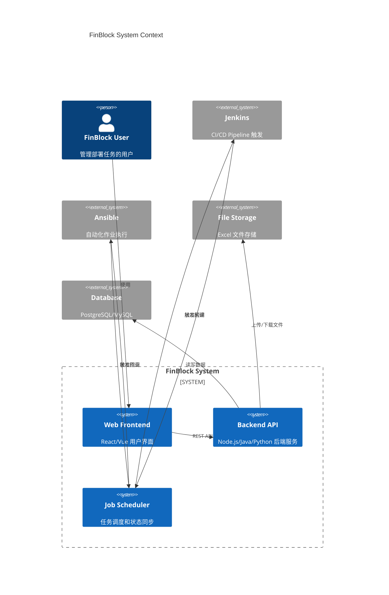
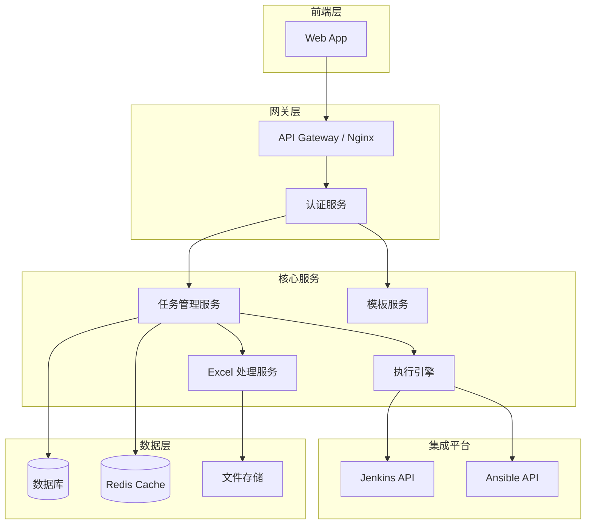
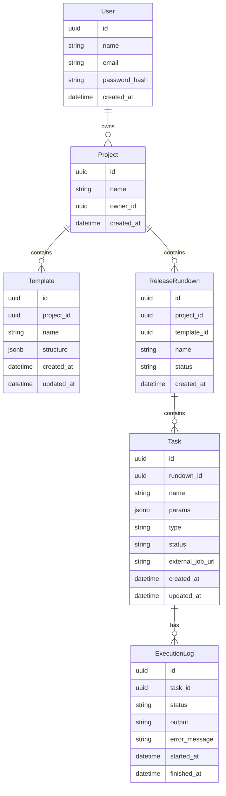
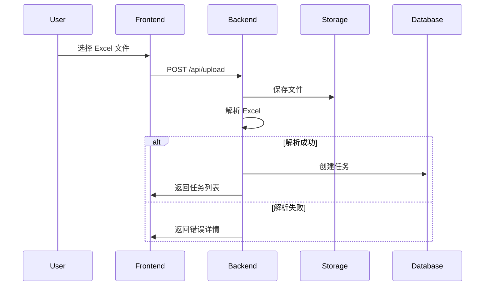
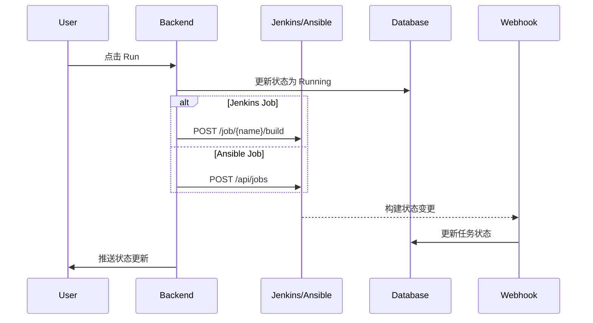

# FinBlock 任务管理系统 - 架构设计

## 1. 设计背景

基于需求分析，设计一套支持任务管理、模板复用、自动化执行的系统架构。

**核心假设**：
- 需要用户认证
- Jenkins/Ansible 已存在并提供 API
- Excel 上传和解析需要可靠处理
- 任务状态需要实时/近实时同步

---

## 2. 系统架构图



---

## 3. 后端服务架构



---

## 4. 核心模块设计

### 4.1 模块职责

| 模块 | 职责 | 技术建议 |
|------|------|----------|
| **Task Management** | 任务的 CRUD、状态管理 | REST API |
| **Template Service** | 模板的创建、克隆、存储 | 继承 Task Management |
| **Excel Processor** | Excel 解析、验证、转换 | Apache POI / xlsx |
| **Execution Engine** | 触发 Jenkins/Ansible、状态同步 | 消息队列 + Webhook |
| **Auth Service** | 用户认证、权限 | JWT / OAuth2 |

### 4.2 数据库 Schema



---

## 5. 关键流程设计

### 5.1 Excel 上传流程



### 5.2 任务执行流程



---

## 6. API 设计 (REST)

### 资源定义

| 资源 | 路径 | 方法 |
|------|------|------|
| 项目 | `/api/v1/projects` | GET, POST |
| 模板 | `/api/v1/templates` | GET, POST, PUT, DELETE |
| 模板克隆 | `/api/v1/templates/{id}/clone` | POST |
| Release Rundown | `/api/v1/rundowns` | GET, POST |
| 任务 | `/api/v1/tasks` | GET, PUT, DELETE |
| 任务执行 | `/api/v1/tasks/{id}/run` | POST |
| 文件上传 | `/api/v1/upload` | POST |

### 响应格式

```json
{
  "success": true,
  "data": { },
  "error": null
}
```

---

## 7. 技术选型建议

| 层级 | 推荐方案 | 备选 |
|------|----------|------|
| **后端** | Spring Boot (Java) / NestJS (Node) | FastAPI (Python) |
| **数据库** | PostgreSQL | MySQL |
| **缓存** | Redis | - |
| **文件存储** | 本地 / S3 / MinIO | - |
| **消息队列** | Redis Pub/Sub / RabbitMQ | - |
| **前端** | React / Vue 3 | - |

---

## 8. 安全考虑

- [ ] 用户认证 (JWT)
- [ ] API 权限校验
- [ ] 文件类型白名单
- [ ] Jenkins/Ansible 凭证加密存储
- [ ] 请求限流
- [ ] 敏感日志脱敏

---

## 9. 待确认事项

1. **技术栈偏好**：Java / Node.js / Python？
2. **部署环境**：云还是私有？
3. **Excel 模板格式**：有现成的模板定义吗？
4. **Jenkins/Ansible 认证**：使用 API Token？
性要求**：WebSocket 还是轮5. **实时询？

---

*文档版本：v1.0*
*创建时间：2026-03-11*
