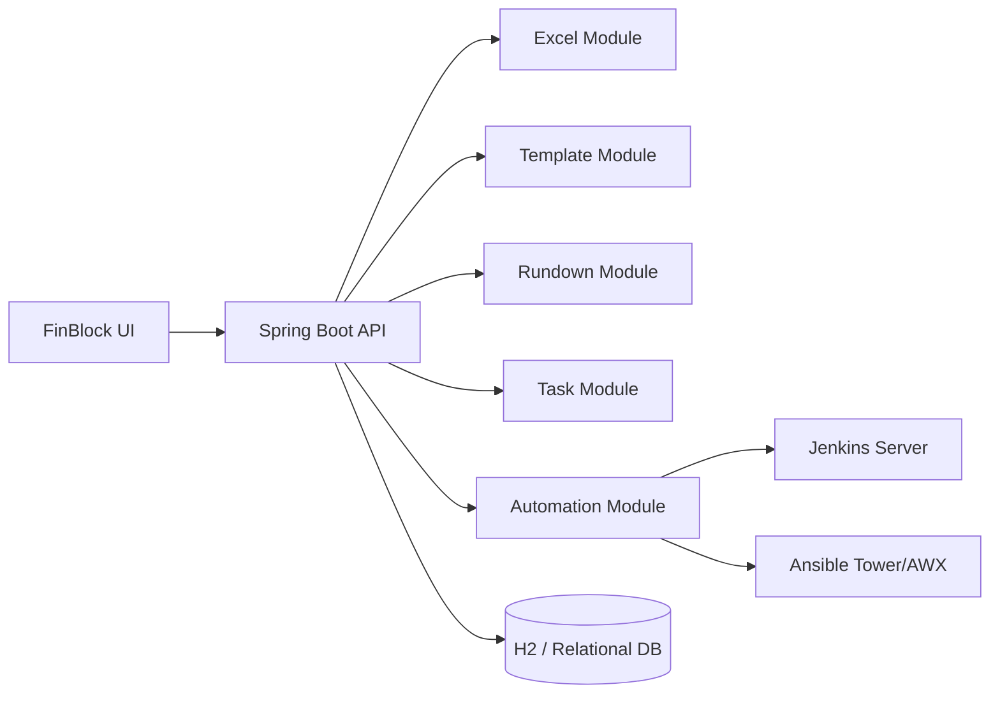

## Architecture

### High-Level Overview

- **Tech Stack**
  - Backend: Spring Boot 3 (Java 21)
  - Persistence: Spring Data JPA + H2（开发阶段，后续可切换 MySQL/PostgreSQL）
  - Build: Maven
  - Excel 解析: Apache POI（可配合 EasyExcel）
  - 实时状态: WebSocket 或 Server-Sent Events（SSE）

- **Architecture Style**
  - 分层单体架构：
    - API 层（`controller`）
    - 领域服务层（`service`）
    - 持久化层（`repository`）
    - 外部集成层（`integration`：Jenkins / Ansible）
    - 公共基础设施层（`common`：异常、DTO、结果包装等）

### Logical Components

- **Excel Module (`excel`)**
  - 接收和校验文件上传请求。
  - 使用 Apache POI 解析 Excel。
  - 将解析错误转为结构化响应。

- **Template Module (`template`)**
  - 模板及模板任务的 CRUD。
  - 模板克隆（复制模板及其任务列表）。

- **Rundown Module (`rundown`)**
  - 从模板生成 Release Rundown。
  - 管理 Rundown 生命周期与状态。

- **Task Module (`task`)**
  - Rundown 中任务的编辑与删除。
  - 触发任务执行（委托给 Automation Module）。

- **Automation Module (`automation`)**
  - 负责与 Jenkins / Ansible 交互。
  - 通过统一接口屏蔽不同自动化工具的差异。
  - 管理任务执行状态、外部 URL 与日志。

### Component Diagram

### Package Structure (Proposed)

- `com.taskmanagement`
  - `excel`
  - `template`
  - `rundown`
  - `task`
  - `automation`
  - `common`
  - `config`

### Key Architectural Decisions

- **单体 + 分域分包**：当前需求复杂度和团队规模下，单体架构配合清晰的领域分包更便于快速迭代与维护。
- **JPA + H2 内存库**：开发阶段使用内存数据库，降低配置成本，并通过 JPA 保持对后续生产数据库的可迁移性。
- **策略 + 适配器模式处理自动化类型**：Jenkins 与 Ansible 通过统一 `AutomationClient` 接口接入，方便扩展其他执行后端。
- **实时状态通过推送而非轮询**：减少客户端轮询压力，提升用户体验。

