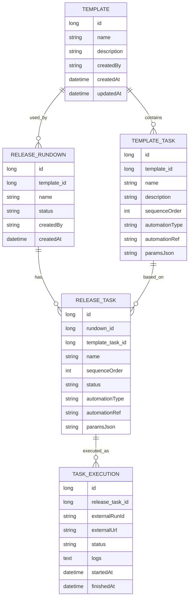

## Data Model

### ER Overview

- 核心实体：
  - 模板：`Template`
  - 模板任务：`TemplateTask`
  - Release Rundown：`ReleaseRundown`
  - Rundown 任务：`ReleaseTask`
  - 任务执行记录：`TaskExecution`

### Table Summaries

- **template**
  - 描述可复用的任务模板。

- **template_task**
  - 定义模板中的单个任务和执行配置。

- **release_rundown**
  - 从模板实例化出的发布执行单元。

- **release_task**
  - Rundown 内部的实际任务实例，可与模板任务不同步演进（允许编辑）。

- **task_execution**
  - 每次执行的历史记录，包括外部系统的运行 ID、URL 与日志。

