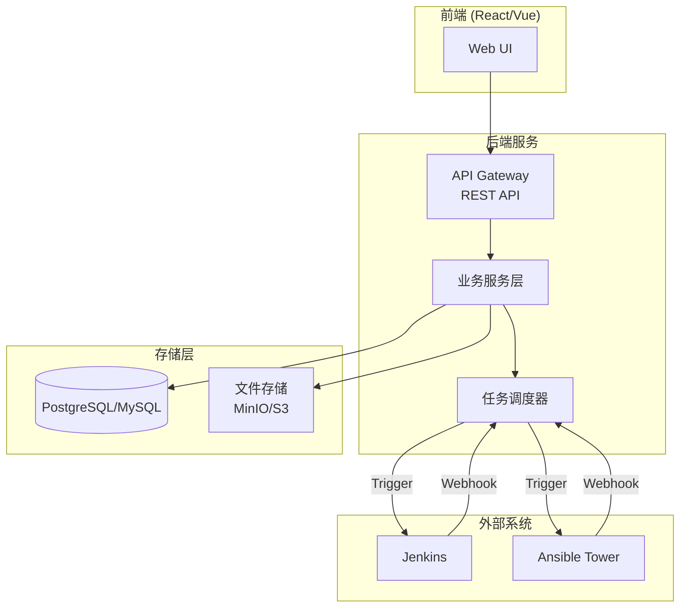

# 系统架构设计 (Architecture)

## 1. 整体架构图



---

## 2. 技术选型

| 层级 | 技术栈 | 选型理由 |
|------|--------|----------|
| **前端** | React + TypeScript | 组件化开发、类型安全 |
| **后端** | Node.js (NestJS) / Python (FastAPI) | 快速迭代、丰富生态 |
| **数据库** | PostgreSQL | 事务支持、JSON 扩展 |
| **文件存储** | MinIO (兼容 S3) | 自部署、兼容 S3 协议 |
| **任务调度** | Bull + Redis | 可靠的消息队列 |
| **CI/CD 集成** | Jenkins REST API / Ansible Tower API | 标准化接口 |

---

## 3. 模块边界

```
┌─────────────────────────────────────────────────────┐
│                    FinBlock System                   │
├─────────────────────────────────────────────────────┤
│  📁 Excel导入服务                                     │
│     - 文件校验 (MIME type, extension)               │
│     - 解析 (xlsx 库)                                  │
│     - 数据验证                                        │
├─────────────────────────────────────────────────────┤
│  📁 模板管理服务                                      │
│     - CRUD (模板)                                    │
│     - 克隆逻辑                                        │
├─────────────────────────────────────────────────────┤
│  📁 Rundown 服务                                     │
│     - 生成 rundown                                   │
│     - 状态管理                                        │
├─────────────────────────────────────────────────────┤
│  📁 任务执行服务                                      │
│     - 执行器抽象 (Executor Plugin)                    │
│     - Webhook 回调处理                               │
│     - 状态同步                                        │
└─────────────────────────────────────────────────────┘
```

---

## 4. 核心设计原则

1. **插件化执行器**: 新增 CI/CD 工具只需实现 `Executor` 接口
2. **事件驱动**: 外部系统回调通过 Webhook 入队，保证最终一致性
3. **幂等性**: 任务执行支持幂等重试，防止重复触发
4. **冷热分离**: 历史执行日志归档，热数据保留 30 天
