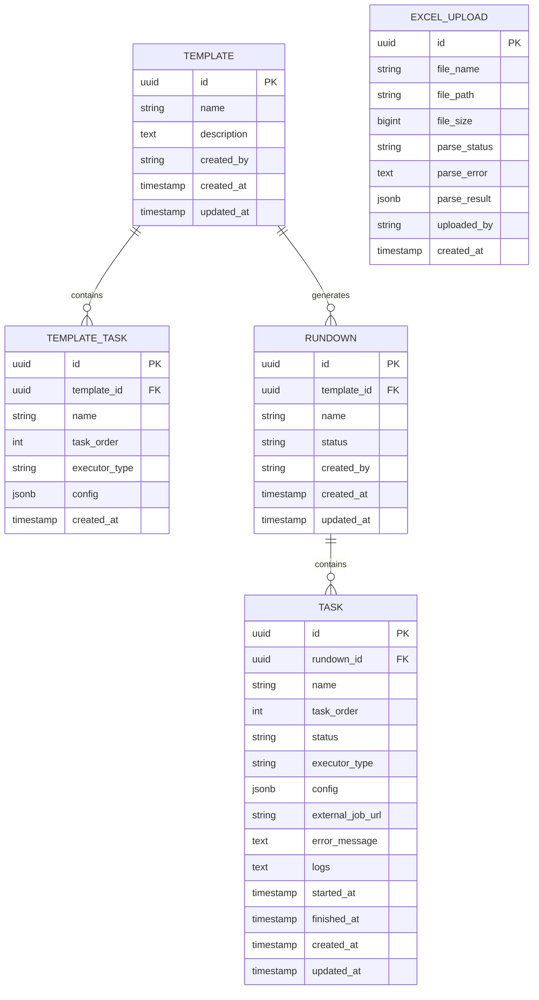

# 数据模型设计 (Data Model)

## 1. 数据库表结构

### 1.1 templates - 模板表

| 字段 | 类型 | 约束 | 描述 |
|------|------|------|------|
| id | UUID | PK | 主键 |
| name | VARCHAR(255) | NOT NULL | 模板名称 |
| description | TEXT | NULLABLE | 描述 |
| created_by | VARCHAR(100) | NOT NULL | 创建人 |
| created_at | TIMESTAMP | NOT NULL | 创建时间 |
| updated_at | TIMESTAMP | NOT NULL | 更新时间 |

### 1.2 template_tasks - 模板任务表

| 字段 | 类型 | 约束 | 描述 |
|------|------|------|------|
| id | UUID | PK | 主键 |
| template_id | UUID | FK → templates.id | 所属模板 |
| name | VARCHAR(255) | NOT NULL | 任务名称 |
| task_order | INT | NOT NULL | 排序 |
| executor_type | VARCHAR(50) | NOT NULL | 执行器类型 (jenkins/ansible) |
| config | JSONB | NOT NULL | 执行配置 |
| created_at | TIMESTAMP | NOT NULL | 创建时间 |

### 1.3 rundowns - 发布 rundown 表

| 字段 | 类型 | 约束 | 描述 |
|------|------|------|------|
| id | UUID | PK | 主键 |
| name | VARCHAR(255) | NOT NULL | Rundown 名称 |
| template_id | UUID | FK → templates.id | 来源模板 |
| status | VARCHAR(50) | NOT NULL | 状态 (pending/running/completed/failed) |
| created_by | VARCHAR(100) | NOT NULL | 创建人 |
| created_at | TIMESTAMP | NOT NULL | 创建时间 |
| updated_at | TIMESTAMP | NOT NULL | 更新时间 |

### 1.4 tasks - 任务表

| 字段 | 类型 | 约束 | 描述 |
|------|------|------|------|
| id | UUID | PK | 主键 |
| rundown_id | UUID | FK → rundowns.id | 所属 rundown |
| name | VARCHAR(255) | NOT NULL | 任务名称 |
| task_order | INT | NOT NULL | 排序 |
| status | VARCHAR(50) | NOT NULL | 状态 (pending/in_progress/completed/failed) |
| executor_type | VARCHAR(50) | NOT NULL | 执行器类型 |
| config | JSONB | NOT NULL | 执行配置 |
| external_job_url | VARCHAR(500) | NULLABLE | 外部 Job URL |
| error_message | TEXT | NULLABLE | 错误信息 |
| logs | TEXT | NULLABLE | 执行日志 |
| started_at | TIMESTAMP | NULLABLE | 开始时间 |
| finished_at | TIMESTAMP | NULLABLE | 结束时间 |
| created_at | TIMESTAMP | NOT NULL | 创建时间 |
| updated_at | TIMESTAMP | NOT NULL | 更新时间 |

### 1.5 excel_uploads - Excel 上传记录表

| 字段 | 类型 | 约束 | 描述 |
|------|------|------|------|
| id | UUID | PK | 主键 |
| file_name | VARCHAR(255) | NOT NULL | 文件名 |
| file_path | VARCHAR(500) | NOT NULL | 文件存储路径 |
| file_size | BIGINT | NOT NULL | 文件大小 |
| parse_status | VARCHAR(50) | NOT NULL | 解析状态 (pending/success/failed) |
| parse_error | TEXT | NULLABLE | 解析错误信息 |
| parse_result | JSONB | NULLABLE | 解析结果数据 |
| uploaded_by | VARCHAR(100) | NOT NULL | 上传人 |
| created_at | TIMESTAMP | NOT NULL | 创建时间 |

---

## 2. 索引设计

| 表名 | 索引名 | 字段 | 描述 |
|------|--------|------|------|
| templates | idx_templates_created_by | created_by | 按创建人查询 |
| template_tasks | idx_template_tasks_template_id | template_id | 查模板的任务 |
| rundowns | idx_rundowns_status | status | 按状态筛选 |
| rundowns | idx_rundowns_created_by | created_by | 按创建人筛选 |
| tasks | idx_tasks_rundown_id | rundown_id | 查 rundown 的任务 |
| tasks | idx_tasks_status | status | 按状态筛选 |
| tasks | idx_tasks_external_job_url | external_job_url | 外部链接查询 |

---

## 3. ER 关系图

---

## 4. 数据一致性策略

1. **任务状态同步**: 使用 "事务 + 最终一致性" 模式
   - 任务状态变更先写数据库，再触发外部系统
   - 外部回调更新状态，保证最终一致
   
2. **删除级联**: 
   - 删除模板时，级联删除 template_tasks
   - 删除 rundown 时，级联删除 tasks
   - 删除任务时，保留执行日志 (软删除)

3. **冷热分离**:
   - 30 天内的任务保留完整 logs
   - 历史日志归档到 OSS/冷存
