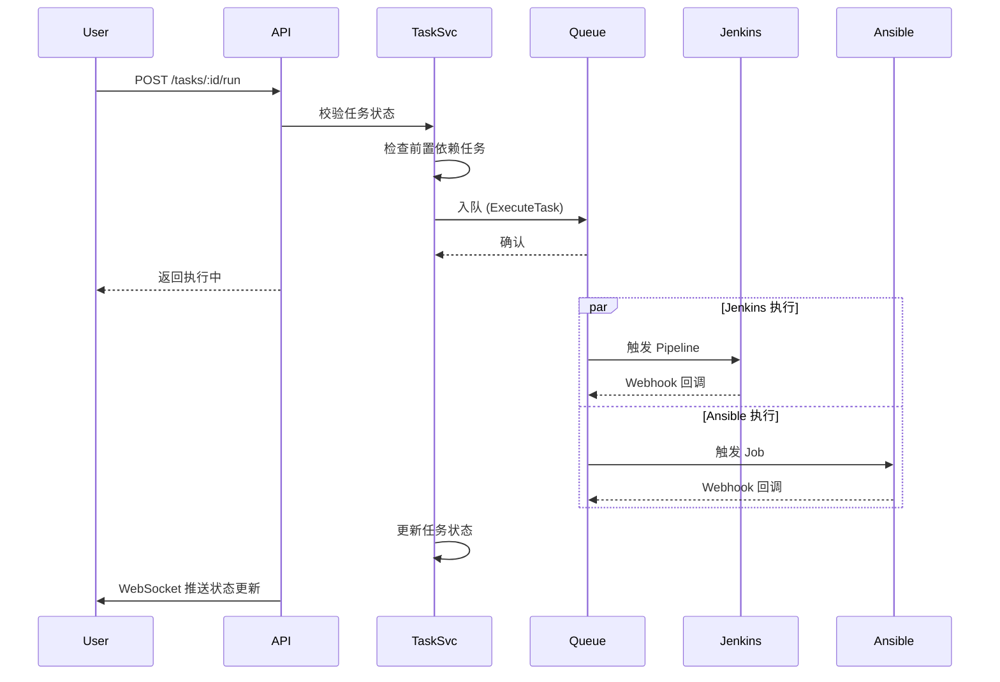
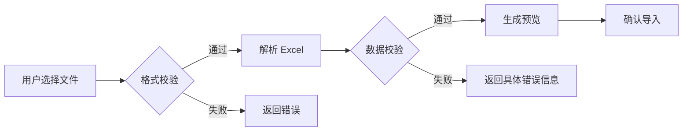

# 详细设计与 API 规范 (Design)

## 1. API 列表

### 1.1 Excel 导入

| 方法 | 路径 | 描述 |
|------|------|------|
| `POST` | `/api/v1/excel/upload` | 上传 Excel 文件 |
| `GET` | `/api/v1/excel/parse-result/:taskId` | 获取解析结果 |

### 1.2 模板管理

| 方法 | 路径 | 描述 |
|------|------|------|
| `GET` | `/api/v1/templates` | 获取模板列表 |
| `POST` | `/api/v1/templates` | 创建模板 |
| `GET` | `/api/v1/templates/:id` | 获取模板详情 |
| `PUT` | `/api/v1/templates/:id` | 更新模板 |
| `DELETE` | `/api/v1/templates/:id` | 删除模板 |
| `POST` | `/api/v1/templates/:id/clone` | 克隆模板 |

### 1.3 Rundown 管理

| 方法 | 路径 | 描述 |
|------|------|------|
| `GET` | `/api/v1/rundowns` | 获取 rundown 列表 |
| `POST` | `/api/v1/rundowns` | 创建 rundown (从模板) |
| `GET` | `/api/v1/rundowns/:id` | 获取 rundown 详情 |
| `DELETE` | `/api/v1/rundowns/:id` | 删除 rundown |

### 1.4 任务控制

| 方法 | 路径 | 描述 |
|------|------|------|
| `GET` | `/api/v1/rundowns/:rundownId/tasks` | 获取任务列表 |
| `GET` | `/api/v1/tasks/:id` | 获取任务详情 |
| `PUT` | `/api/v1/tasks/:id` | 编辑任务 |
| `DELETE` | `/api/v1/tasks/:id` | 删除任务 |
| `POST` | `/api/v1/tasks/:id/run` | 执行任务 |
| `GET` | `/api/v1/tasks/:id/logs` | 获取执行日志 |

### 1.5 Webhook 回调

| 方法 | 路径 | 描述 |
|------|------|------|
| `POST` | `/api/v1/webhooks/jenkins` | Jenkins 构建回调 |
| `POST` | `/api/v1/webhooks/ansible` | Ansible 任务回调 |

---

## 2. 数据结构定义

### 2.1 模板 (Template)

```typescript
interface Template {
  id: string;
  name: string;
  description?: string;
  tasks: TaskTemplate[];
  createdBy: string;
  createdAt: Date;
  updatedAt: Date;
}

interface TaskTemplate {
  id: string;
  name: string;
  order: number;
  executorType: 'jenkins' | 'ansible' | 'custom';
  config: {
    jobName?: string;        // Jenkins job 名称
    jobParams?: Record<string, string>;
    playbook?: string;       // Ansible playbook
    inventory?: string;
    extraVars?: Record<string, any>;
  };
}
```

### 2.2 Rundown

```typescript
interface Rundown {
  id: string;
  name: string;
  templateId: string;
  status: 'pending' | 'running' | 'completed' | 'failed';
  tasks: Task[];
  createdBy: string;
  createdAt: Date;
  updatedAt: Date;
}

interface Task {
  id: string;
  rundownId: string;
  name: string;
  order: number;
  status: 'pending' | 'in_progress' | 'completed' | 'failed';
  executorType: 'jenkins' | 'ansible';
  config: TaskConfig;
  externalJobUrl?: string;    // Jenkins build URL / Ansible job URL
  errorMessage?: string;
  logs?: string;
  startedAt?: Date;
  finishedAt?: Date;
}
```

---

## 3. 核心流程时序图

### 3.1 任务执行流程



### 3.2 Excel 导入流程



---

## 4. 错误处理规范

| 错误码 | 描述 | 示例 |
|--------|------|------|
| 400 | 请求参数错误 | 缺少必填字段 |
| 401 | 未授权 | Token 无效 |
| 403 | 无权限 | 无操作权限 |
| 404 | 资源不存在 | 模板/rundown 不存在 |
| 413 | 文件过大 | 超过 10MB |
| 415 | 不支持的格式 | 非 .xlsx/.xls |
| 500 | 内部错误 | 服务异常 |

---

## 5. WebSocket 事件

| 事件名 | 描述 | Payload |
|--------|------|---------|
| `task:status_changed` | 任务状态变更 | `{ taskId, status, externalJobUrl? }` |
| `task:failed` | 任务执行失败 | `{ taskId, errorMessage }` |
| `rundown:completed` | Rundown 全部完成 | `{ rundownId }` |
