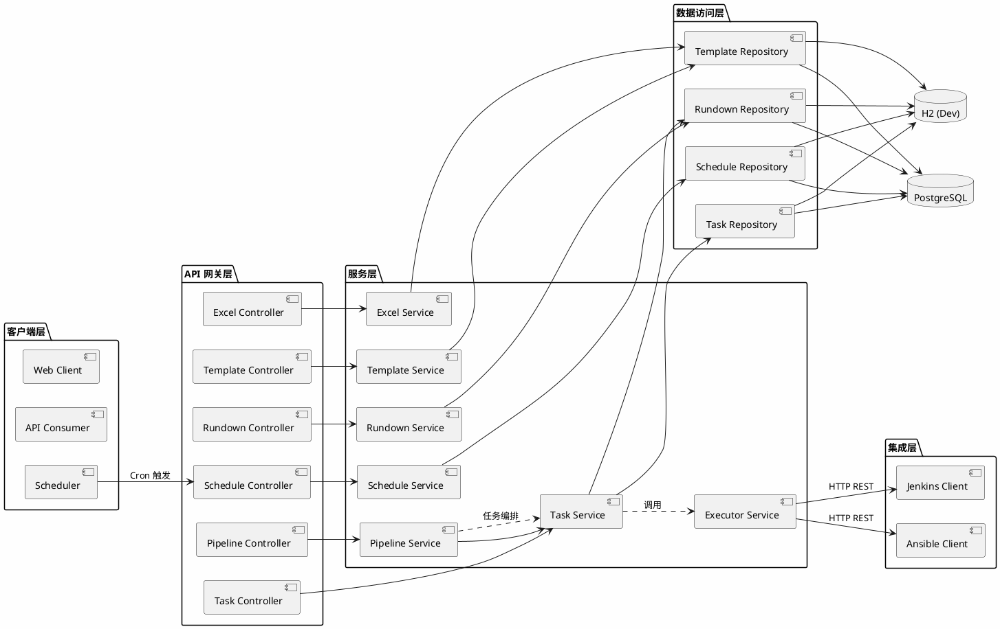

# FinBlock 任务管理系统 - 系统架构设计

## 1. 架构总览

FinBlock 任务管理系统采用**分层架构 (Layered Architecture)**，基于 Spring Boot 构建 RESTful API 服务，通过集成 Jenkins 和 Ansible 实现自动化部署能力。

```
┌─────────────────────────────────────────────────────────────────────────┐
│                           客户端层 (Clients)                            │
│  ┌─────────────┐  ┌─────────────┐  ┌─────────────┐  ┌─────────────┐     │
│  │   Web UI    │  │   Mobile    │  │   API       │  │  Scheduler  │     │
│  │  (Future)   │  │  (Future)   │  │  Consumer   │  │   (Cron)    │     │
│  └─────────────┘  └─────────────┘  └─────────────┘  └─────────────┘     │
└─────────────────────────────────────────────────────────────────────────┘
                                    │
                                    ▼
┌─────────────────────────────────────────────────────────────────────────┐
│                        API 网关层 (API Gateway)                         │
│                    (Spring Boot REST Controllers)                        │
│  ┌─────────────┐  ┌─────────────┐  ┌─────────────┐  ┌─────────────┐     │
│  │ExcelController│ │TemplateCtrl│ │RundownCtrl │ │PipelineCtrl │     │
│  └─────────────┘  └─────────────┘  └─────────────┘  └─────────────┘     │
└─────────────────────────────────────────────────────────────────────────┘
                                    │
                                    ▼
┌─────────────────────────────────────────────────────────────────────────┐
│                         服务层 (Service Layer)                           │
│  ┌─────────────┐  ┌─────────────┐  ┌─────────────┐  ┌─────────────┐     │
│  │ExcelService │  │TemplateSvc  │  │RundownSvc   │  │PipelineSvc  │     │
│  │  - 解析Excel │  │  - CRUD    │  │  - CRUD    │  │  - 串行执行 │     │
│  │  - 数据校验 │  │  - 克隆     │  │  - 状态管理│  │  - 失败处理 │     │
│  └─────────────┘  └─────────────┘  └─────────────┘  └─────────────┘     │
│  ┌─────────────┐  ┌─────────────┐  ┌─────────────┐                     │
│  │TaskService  │  │ScheduleSvc  │  │ExecutorSvc  │                     │
│  │  - CRUD    │  │  - 定时调度  │  │  - Jenkins │                     │
│  │  - 状态管理│  │  - Cron解析  │  │  - Ansible │                     │
│  └─────────────┘  └─────────────┘  └─────────────┘                     │
└─────────────────────────────────────────────────────────────────────────┘
                                    │
                                    ▼
┌─────────────────────────────────────────────────────────────────────────┐
│                      集成层 (Integration Layer)                          │
│  ┌─────────────────────────┐  ┌─────────────────────────┐             │
│  │    Jenkins Client       │  │    Ansible Client        │             │
│  │  - 触发 Pipeline Job   │  │  - 触发 Job             │             │
│  │  - 获取构建状态        │  │  - 获取执行状态          │             │
│  └─────────────────────────┘  └─────────────────────────┘             │
└─────────────────────────────────────────────────────────────────────────┘
                                    │
                                    ▼
┌─────────────────────────────────────────────────────────────────────────┐
│                      数据访问层 (Repository Layer)                       │
│  ┌─────────────┐  ┌─────────────┐  ┌─────────────┐  ┌─────────────┐     │
│  │TemplateRepo │  │ RundownRepo │  │  TaskRepo   │  │ScheduleRepo │     │
│  └─────────────┘  └─────────────┘  └─────────────┘  └─────────────┘     │
└─────────────────────────────────────────────────────────────────────────┘
                                    │
                                    ▼
┌─────────────────────────────────────────────────────────────────────────┐
│                        数据存储层 (Data Layer)                          │
│  ┌─────────────────────────┐  ┌─────────────────────────┐             │
│  │    PostgreSQL           │  │    H2 (Dev Only)        │             │
│  │    (Production)         │  │                         │             │
│  └─────────────────────────┘  └─────────────────────────┘             │
└─────────────────────────────────────────────────────────────────────────┘
```

## 2. 技术栈选型

| 分类 | 选型 | 理由 |
|------|------|------|
| **后端框架** | Spring Boot 3.x | 成熟稳定，生态丰富，社区活跃 |
| **构建工具** | Maven | Java 标准构建工具，与 Spring 深度集成 |
| **数据库** | PostgreSQL | 企业级关系型数据库，支持复杂查询 |
| **开发数据库** | H2 | 内存数据库，开发环境快速启动 |
| **持久层框架** | Spring Data JPA | 简化数据库操作，自动生成 SQL |
| **定时任务** | Spring Scheduler / Quartz | 原生支持，无需额外依赖 |
| **Excel 处理** | Apache POI | 功能强大的 Office 文档处理库 |
| **外部集成** | Jenkins REST API | 标准化接口，支持 Pipeline 触发 |
| **外部集成** | Ansible Tower API | 标准化接口，支持 Job 触发 |
| **API 文档** | Swagger / OpenAPI 3.0 | 自动生成 API 文档，便于调试 |
| **日志** | SLF4J + Logback | Spring 默认日志框架 |

## 3. 组件图 (PlantUML)



## 4. 核心数据流

### 4.1 Excel 导入流程

```
用户上传 Excel 
    ↓
ExcelController.upload()
    ↓
ExcelService.parseExcel() → Apache POI 解析
    ↓
ExcelService.validateData() → 数据完整性校验
    ↓
生成 Task 列表
    ↓
返回预览数据给前端
```

### 4.2 Pipeline 执行流程

```
用户触发 Pipeline
    ↓
PipelineController.execute()
    ↓
PipelineService.executePipeline()
    ↓
遍历任务列表，顺序执行:
    ↓
TaskService.executeTask()
    ↓
ExecutorService.triggerJenkins() / triggerAnsible()
    ↓
等待外部系统回调或轮询状态
    ↓
更新任务状态 (RUNNING / SUCCESS / FAILED)
    ↓
前置任务成功 → 继续执行下一任务
    前置任务失败 → 终止 Pipeline
```

### 4.3 定时任务流程

```
Scheduler 创建定时任务
    ↓
Spring Scheduler 按 Cron 触发
    ↓
ScheduleService.executeScheduledTask()
    ↓
根据任务类型调用:
    - TaskService.executeTask() (单个任务)
    - PipelineService.executePipeline() (Pipeline)
    - RundownBatchService.executeBatch() (批量执行)
```

## 5. 模块设计

### 5.1 Excel 导入模块

| 类 | 职责 |
|----|------|
| `ExcelController` | 处理 Excel 上传请求 |
| `ExcelService` | 解析 Excel、校验数据、生成任务 |
| `ExcelParser` | 封装 Apache POI 解析逻辑 |
| `ExcelValidator` | 数据完整性校验 |

### 5.2 模板管理模块

| 类 | 职责 |
|----|------|
| `TemplateController` | CRUD API |
| `TemplateService` | 模板业务逻辑、克隆功能 |
| `TemplateRepository` | 数据持久化 |

### 5.3 Rundown 模块

| 类 | 职责 |
|----|------|
| `RundownController` | Rundown API |
| `RundownService` | Rundown 生成、状态管理 |
| `RundownRepository` | 数据持久化 |

### 5.4 Pipeline 执行模块

| 类 | 职责 |
|----|------|
| `PipelineController` | Pipeline API |
| `PipelineService` | 任务编排、顺序执行、失败处理 |
| `PipelineExecutor` | 执行策略（串行/并行 TBD） |

### 5.5 调度模块

| 类 | 职责 |
|----|------|
| `ScheduleController` | 定时任务 CRUD API |
| `ScheduleService` | 定时调度逻辑、Cron 解析 |
| `SchedulerJob` | Spring Scheduler Job 实现 |

### 5.6 执行器模块

| 类 | 职责 |
|----|------|
| `ExecutorService` | 统一执行入口 |
| `JenkinsClient` | Jenkins REST API 封装 |
| `AnsibleClient` | Ansible Tower API 封装 |
| `ExecutionCallback` | 外部回调处理 |

## 6. 扩展性设计

### 6.1 批量并发执行

- 使用 `CompletableFuture` 实现多 Rundown 并发执行
- 配置线程池大小（建议 20+ 根据需求）
- 单个 Rundown 失败不影响其他执行

### 6.2 外部系统容错

- Jenkins/Ansible 调用失败自动重试 3 次
- 使用 Circuit Breaker 模式防止雪崩
- 失败任务记录详细日志便于排查

### 6.3 数据库扩展

- 使用连接池 (HikariCP) 管理连接
- 索引优化：task_id, rundown_id, status
- 考虑读写分离（V2.0）

## 7. 安全性设计

### 7.1 认证授权

- V1.0: 基础认证 (Basic Auth)
- API Token 认证 (Jenkins/Ansible)
- 请求参数校验防止注入

### 7.2 文件上传安全

- 限制文件大小 ≤ 10MB
- 文件类型白名单 (.xlsx, .xls)
- 上传目录隔离，禁止执行权限

### 7.3 日志审计

- 关键操作记录日志 (INFO)
- 异常场景记录详细堆栈 (ERROR)
- 外部调用记录请求/响应日志

## 8. 目录结构

```
src/main/java/com/finblock/task/
├── controller/
│   ├── ExcelController.java
│   ├── TemplateController.java
│   ├── RundownController.java
│   ├── TaskController.java
│   ├── PipelineController.java
│   └── ScheduleController.java
├── service/
│   ├── ExcelService.java
│   ├── TemplateService.java
│   ├── RundownService.java
│   ├── TaskService.java
│   ├── PipelineService.java
│   ├── ScheduleService.java
│   └── ExecutorService.java
├── repository/
│   ├── TemplateRepository.java
│   ├── RundownRepository.java
│   ├── TaskRepository.java
│   └── ScheduleRepository.java
├── integration/
│   ├── JenkinsClient.java
│   └── AnsibleClient.java
├── model/
│   ├── entity/
│   └── dto/
├── config/
│   ├── SecurityConfig.java
│   ├── JpaConfig.java
│   └── SchedulerConfig.java
└── TaskManagementApplication.java
```

---

*本文档由 SDD Architecture Designer 自动生成*
*基于 spec.md v1.1 生成*
