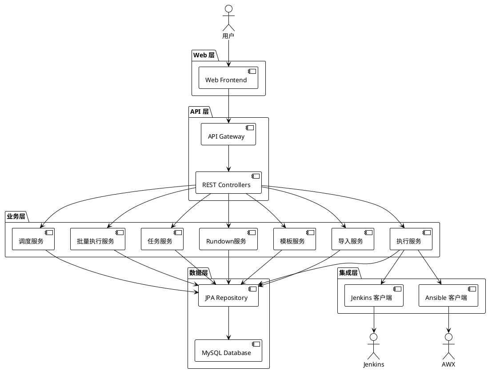
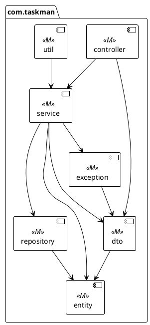
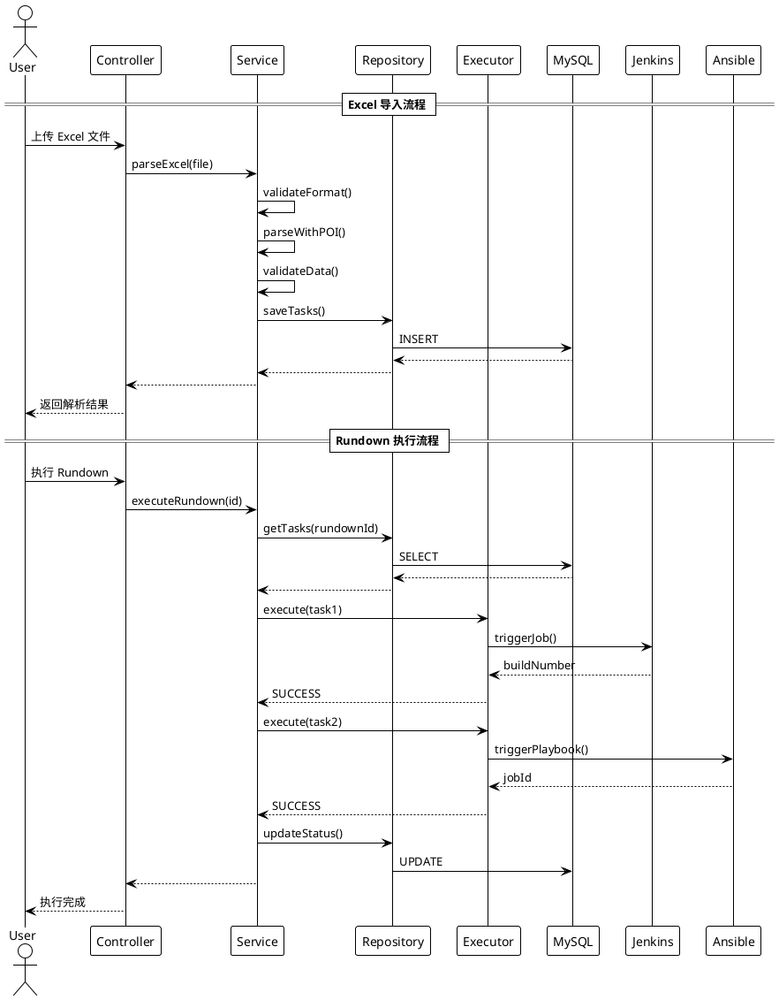
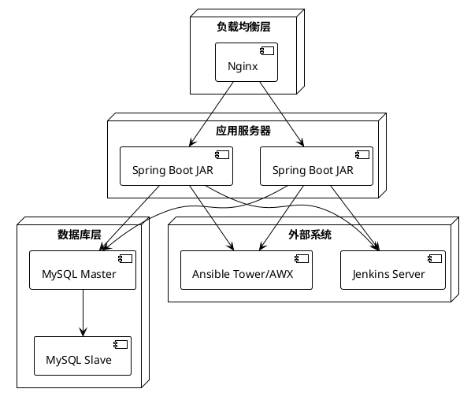
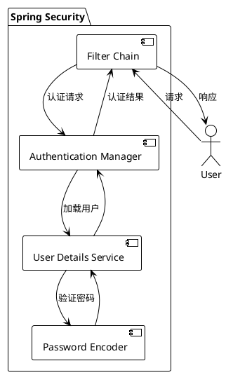
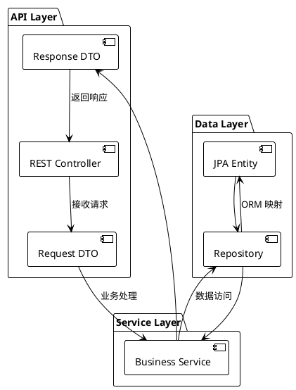

# 任务管理系统 - 系统架构设计

**版本**: 1.0  
**生成日期**: 2026-03-13  
**文档类型**: 系统架构设计说明书  

---

## 1. 系统概述

### 1.1 项目定位

任务管理系统（Task Management System）是一个类 Harness CI/CD 的部署任务管理平台，用于简化部署任务的创建、管理和执行流程。通过提供 Excel 导入、模板管理、多任务顺序执行等功能，帮助运维/部署人员实现多环境链式部署（SIT → UAT → PROD）。

### 1.2 系统边界

| 类别 | 包含 | 不包含 |
|------|------|--------|
| **核心功能** | Excel 导入、模板管理、Rundown 管理、任务执行、定时调度、批量执行 | 用户权限管理 SSO、任务日志分析、第三方集成 |
| **自动化** | Jenkins、Ansible | GitHub Actions、Terraform |
| **用户** | 部署运营人员 | 开发者、访客 |

---

## 2. 技术架构

### 2.1 技术栈

| 层级 | 技术选型 | 版本 |
|------|----------|------|
| **开发语言** | Java | 21 |
| **后端框架** | Spring Boot | 3.x |
| **ORM** | JPA (Hibernate) | 6.x |
| **数据库** | MySQL | 8.x |
| **构建工具** | Maven | 3.9+ |
| **API 文档** | SpringDoc OpenAPI | 2.3.0 |
| **Excel 处理** | Apache POI | 5.2.5 |
| **安全** | Spring Security | 6.x |

### 2.2 系统拓扑

---

## 3. 模块设计

### 3.1 核心模块

| 模块 | 包路径 | 职责 | 关键技术 |
|------|--------|------|----------|
| **导入模块** | `com.taskman.import` | Excel 解析、数据验证 | Apache POI |
| **模板管理** | `com.taskman.template` | 模板 CRUD、克隆、生成 Rundown | JPA |
| **Rundown 管理** | `com.taskman.rundown` | 清单管理、顺序控制 | JPA + 事务 |
| **任务控制** | `com.taskman.task` | 任务 CRUD、状态管理 | JPA |
| **执行服务** | `com.taskman.executor` | Jenkins/Ansible 集成 | REST API |
| **调度服务** | `com.taskman.scheduler` | 定时/Cron 调度 (Rundown 内置) | @Scheduled |
| **批量执行** | `com.taskman.batch` | 并发执行、进度聚合 | @Async + ThreadPool |

### 3.2 模块依赖关系

---

## 4. 数据流设计

### 4.1 核心数据流

---

## 5. 部署架构

### 5.1 生产环境部署

### 5.2 部署配置

| 环境 | 部署方式 | 数据库 | 特点 |
|------|----------|--------|------|
| 开发 | IDE 运行 | MySQL 本地 | 调试方便 |
| 测试 | Docker Compose | MySQL 容器 | 快速启动 |
| 生产 | JAR 部署 / Docker | MySQL 主从 | 高可用 |

---

## 6. 安全架构

### 6.1 认证授权

### 6.2 安全措施

| 层级 | 措施 |
|------|------|
| **认证** | Spring Security Session-based |
| **密码** | BCrypt 哈希 |
| **敏感数据** | AES-256 加密存储 (Jenkins Token、Ansible 凭据) |
| **日志** | 禁止打印明文密码/Token |
| **输入** | @Valid + JSR-303 校验 |

---

## 7. 性能与高可用

### 7.1 性能优化

| 优化点 | 方案 |
|--------|------|
| **数据库连接** | HikariCP 连接池 |
| **异步执行** | @Async + ThreadPoolTaskExecutor |
| **查询优化** | @EntityGraph 避免 N+1 |
| **索引** | 合理设计复合索引 |
| **缓存** | Spring Cache (Caffeine) |

### 7.2 高可用设计

| 组件 | 高可用方案 |
|------|------------|
| 应用服务器 | 多实例 + 负载均衡 |
| 数据库 | MySQL 主从复制 |
| 定时任务 | 分布式锁 (未来扩展) |

---

## 8. 接口设计

### 8.1 API 分层

### 8.2 OpenAPI 集成

SpringDoc 自动生成 API 文档，访问地址：`/swagger-ui.html`

---

## 9. 技术选型理由

| 技术 | 选型理由 |
|------|----------|
| **Java 21** | LTS 版本，性能提升，新特性支持 |
| **Spring Boot** | 生态成熟，自动配置，快速开发 |
| **JPA/Hibernate** | ORM 标准，数据库无关，事务管理 |
| **MySQL** | 轻量易用，社区成熟，满足需求 |
| **Apache POI** | 官方 Excel 库，稳定可靠 |
| **SpringDoc** | 注解驱动，自动生成 OpenAPI 文档 |

---

## 10. 未来扩展

| 方向 | 方案 |
|------|------|
| 权限管理 | Spring Security + JWT |
| 分布式调度 | XXL-JOB |
| 实时推送 | WebSocket |
| 日志分析 | Elasticsearch + Kibana |
| 插件化 | 策略模式 + 动态加载 |

---

*本文档由 Architecture Designer 自动生成*
